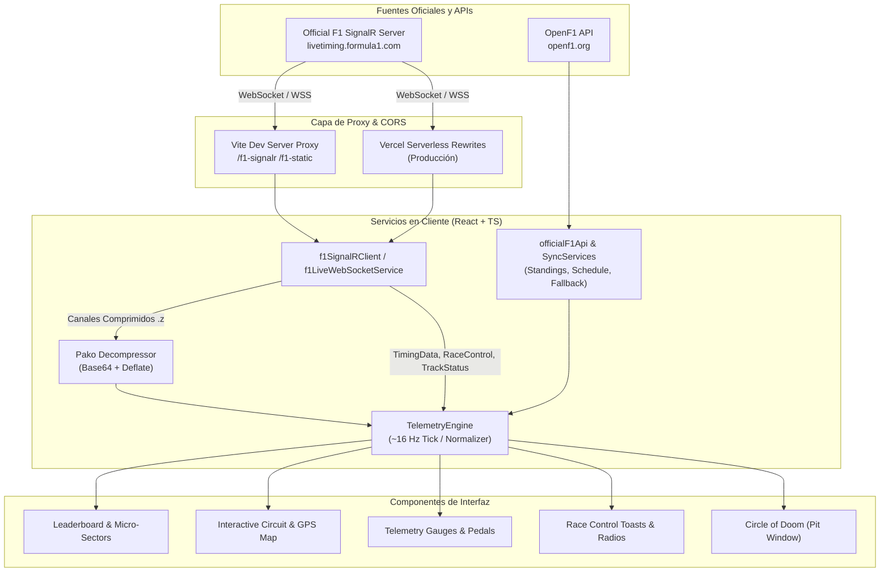

<div align="center">

# 🏎️ UNDERCUT F1
### High-Performance Formula 1® Real-Time Telemetry & Live Timing Dashboard

Plataforma avanzada de telemetría, tiempos en directo y análisis de estrategia para Fórmula 1®, conectada en tiempo real al feed oficial de F1 mediante **SignalR / WebSockets**, con descompresión de paquetes en el cliente y compatibilidad total con la **normativa 2026 (parrilla de 22 monoplazas)**.

[](https://undercut-f1-live.vercel.app/)
[](https://react.dev/)
[](https://www.typescriptlang.org/)
[](https://vitejs.dev/)
[](#-normativa-2026-y-parrilla-de-22-coches)
[](LICENSE)

[🌐 Ver Demo en Directo](https://undercut-f1-live.vercel.app/) • [✨ Características](#-características-principales) • [🏗️ Arquitectura](#%EF%B8%8F-arquitectura-y-flujo-de-datos) • [🚀 Instalación](#-puesta-en-marcha) • [📡 Conexión](#-conexión-signalr-y-protocolo-f1) • [⚖️ Aviso Legal](#%EF%B8%8F-aviso-legal)

---

</div>

## 📌 Visión General

**UNDERCUT F1** es un dashboard web de ingeniería de carrera y telemetría diseñado tanto para aficionados exigentes como para analistas de motorsport. A diferencia de las aplicaciones convencionales basadas en scraping o sondeos lentos por HTTP, **UNDERCUT** negocia una conexión persistente **SignalR Core** por WebSocket directamente con el feed oficial de `livetiming.formula1.com`. 

Los paquetes comprimidos con Deflate (`.z`) son descomprimidos al vuelo en el navegador a través de WebAssembly/JavaScript, alimentando un motor reactivo de telemetría a ~16 Hz que sincroniza posiciones, intervalos, micro-sectores, telemetría por piloto, trazados GPS y mensajes de control de carrera con latencia mínima.

---

## ✨ Características Principales

### ⏱️ Live Timing & Leaderboard Profesional
- **Micro-sectores en tiempo real**: Desglose de cada sector (S1, S2, S3) con 25 mini-segmentos por vuelta, tiempos personales en verde y sectores récord absolutos de sesión en morado (*purple*).
- **Animaciones FLIP**: Transiciones fluidas en la reordenación de filas cuando hay cambios de posición o adelantamientos en pista, evitando saltos bruscos.
- **Alertas de adelantamiento en directo**: Indicadores dinámicos de ganancia/pérdida de posiciones (`▲ +1`, `▼ -1`) y avisos emergentes de adelantamientos detectados al instante.
- **Seguimiento riguroso de Pit Lane**: Detección sin falsos positivos de estados de parada (`IN PIT`), vueltas de salida de boxes (`OUT LAP`) y monoplazas en pista (`PISTA`), junto al historial de paradas y edad del neumático (compuestos Soft, Medium, Hard, Intermediate y Wet con sus respectivos códigos de color oficiales de Pirelli).
- **Colores oficiales de escuderías con alto contraste**: Paleta ajustada al reglamento 2026 (Ferrari, Red Bull, Mercedes, McLaren, Aston Martin, Alpine, Williams, Audi, RB, Haas y Cadillac).

### 🚦 Normativa 2026 y Parrilla de 22 Coches
- **Líneas de corte dinámicas de Clasificación (Qualy)**:
  - **Q1**: Corte en **P16/P17** (*Top 16 avanzan*, 6 eliminados).
  - **Q2**: Corte en **P10/P11** (*Top 10 avanzan a Q3*, 6 eliminados).
  - **Q3**: Batalla final por la Pole Position entre los 10 mejores.
- **Zonas de peligro visuales**: Sombreado de advertencia en rojo (`elimination-danger`) para pilotos en riesgo de eliminación y separación nítida con pilotos ya eliminados (`knocked-out`).
- **Soporte de 11 escuderías**: Integración de **Cadillac Formula 1 Team** y la transición a **Audi F1 Team**.

### 🏎️ Telemetría y Análisis del Monoplaza
- **Métricas de chasis y unidad de potencia**: Velocidad punta (km/h), indicador de RPM, marcha engranada, porcentajes de acelerador (*throttle*) y freno (*brake*), activación de DRS, fuerzas G laterales y longitudinales, y estado de la batería ERS (despliegue y regeneración).
- **Benchmarks de vuelta rápida**: Comparativa frente a la mejor vuelta teórica (suma de mejores sectores) y del líder.
- **Selector rápido de piloto**: Inspección individualizada con solo hacer clic en cualquier fila de la tabla de tiempos.

### 🗺️ Mapa de Circuito Interactivo & GPS
- **Geometría vectorial real de circuitos**: Renderizado de trazados de la temporada con mapas Mapbox interactivos y capas SVG de alta precisión.
- **Ubicación en vivo de los monoplazas**: Posicionamiento en pista mediante interpolación de coordenadas de telemetría oficial.
- **Sincronización de banderas de pista**: Actualización inmediata del estado de banderas por sector y pista completa (Bandera Verde, Amarilla, Doble Amarilla, Safety Car, Virtual Safety Car y Bandera Roja).

### 🔮 Circle of Doom & Ventana de Parada
- **Calculadora de estrategia de parada en boxes**: Estimación del tiempo perdido en pit lane (*pit loss time*) y predicción de la posición de reincorporación a pista en tráfico para evaluar *undercut* y *overcut*.

### 📢 Control de Carrera & Radios de Equipo
- **Feed de Dirección de Carrera**: Mensajes oficiales de la FIA (investigaciones, sanciones, habilitación de DRS, coches de seguridad, banderas amarillas y avisos de límites de pista).
- **Notificaciones Toast no intrusivas**: Alertas emergentes en la esquina inferior derecha con estilos diferenciados por severidad (sanciones, seguridad, banderas) y desduplicación inteligente de eventos.
- **Transcripciones de radio**: Registro de transmisiones de radio de los pilotos en directo.

### 🏆 Clasificación Mundial & Calendario 2026
- **Mundial de Pilotos y Constructores**: Puntuaciones acumuladas y proyección de puntos en tiempo real durante la carrera.
- **Calendario oficial de Grandes Premios 2026**: Fechas, circuitos, formato de fin de semana (estándar o Sprint) y cuenta atrás para cada sesión (FP1, FP2, FP3, Qualy, Sprint y Carrera).
- **Soporte Multilingüe**: Interfaz completamente traducida en **Español, Inglés, Francés e Italiano**.

---

## 🏗️ Arquitectura y Flujo de Datos



---

## 🧱 Stack Tecnológico

| Capa | Herramienta / Librería | Versión | Propósito |
|---|---|---|---|
| **Core Framework** | [React](https://react.dev/) | `^19.2.8` | Interfaz declarativa, hooks modernos y concurrencia |
| **Lenguaje** | [TypeScript](https://www.typescriptlang.org/) | `~6.0.2` | Tipado estricto de paquetes de telemetría y modelos F1 |
| **Bundler & Tooling** | [Vite](https://vitejs.dev/) | `^8.2.2` | Entorno de desarrollo ultra rápido y proxy integrado |
| **Linter** | [Oxlint](https://oxc-project.github.io/) | `^1.79.0` | Análisis estático de código ultra veloz basado en Rust |
| **Descompresión** | [pako](https://github.com/nodeca/pako) | `^3.0.1` | Descompresión en cliente de canales comprimidos `.z` (Deflate) |
| **Serialización** | [cbor-x](https://github.com/kriszyp/cbor-x) | `^1.6.6` | Decodificación binaria de alta velocidad |
| **Mapas & Geometría** | [Mapbox GL JS](https://www.mapbox.com/) | `^3.30.0` | Trazados de circuito satelitales y vectoriales interactivos |
| **Iconografía** | [Lucide React](https://lucide.dev/) | `^1.44.0` | Iconos vectoriales limpios y consistentes |
| **Hosting & CI/CD** | [Vercel](https://vercel.com/) | Edge Rewrites | Despliegue con reescrituras de proxy a `livetiming.formula1.com` |

---

## 📡 Conexión SignalR y Protocolo F1

El dashboard consume los canales oficiales de **F1 Live Timing** siguiendo el protocolo SignalR Core:

1. **Negociación inicial**: Envía una petición `POST` al endpoint de negociación (`/f1-signalr/negotiate`) para obtener el token de conexión y las capacidades soportadas.
2. **Apertura de WebSocket**: Conexión al socket `wss://livetiming.formula1.com/signalrcore` con subprotocolo `json`.
3. **Handshake Protocol**: Intercambio de paquete de inicialización:
   ```json
   { "protocol": "json", "version": 1 }
   ```
4. **Suscripción a Tópicos**: Invoca el método `Subscribe` solicitando los canales de la sesión:
   ```json
   {
     "H": "Streaming",
     "M": "Subscribe",
     "A": [[
       "Heartbeat",
       "CarData.z",
       "Position.z",
       "TimingData",
       "TimingAppData",
       "TrackStatus",
       "WeatherData",
       "RaceControlMessages",
       "SessionInfo",
       "DriverList",
       "TeamRadio",
       "LapCount"
     ]],
     "I": 1
   }
   ```
5. **Inflado de datos en tiempo real**: Los canales con sufijo `.z` contienen payloads comprimidos en Base64 con algoritmo Deflate. Se decodifican mediante `pako.inflateRaw()` antes de agregarse al estado de la telemetría.
6. **Modo Respaldo / Off-Session**: Cuando no hay una sesión activa en pista, la aplicación cambia de manera inteligente a modo preview/OpenF1 para consultar datos de la última sesión disputada o mostrar el estado del próximo Gran Premio.

---

## 🚀 Puesta en Marcha

### Requisitos Previos

- **Node.js**: `18.x` o superior (se recomienda `20.x` LTS o `22.x`)
- **npm**: `9.x` o superior

### 1. Clonar el Repositorio

```bash
git clone https://github.com/alehinarejos/Undercut-F1.git
cd Undercut-F1
```

### 2. Instalar Dependencias

```bash
npm install
```

### 3. Configurar Variables de Entorno

Copia el archivo de ejemplo `.env.example` a `.env.local`:

```bash
cp .env.example .env.local
```

Configura tus credenciales (opcional para el mapa con estilo Mapbox personalizado):

```env
# Mapbox Token (para el renderizado de satélite/vectorial del circuito)
VITE_MAPBOX_TOKEN=tu_token_de_mapbox_aqui
VITE_MAPBOX_STYLE=mapbox://styles/mapbox/dark-v11
```

### 4. Iniciar Servidor de Desarrollo

```bash
npm run dev
```

Abre tu navegador en `http://localhost:5173`. 

> [!NOTE]
> Vite incluye en su archivo `vite.config.ts` un proxy de desarrollo que redirige `/f1-signalr` y `/f1-static` hacia `livetiming.formula1.com`, eludiendo las restricciones de CORS del navegador durante el desarrollo local.

---

## 🛠️ Scripts del Proyecto

| Comando | Descripción |
|---|---|
| `npm run dev` | Inicia el servidor de desarrollo local con Hot Module Replacement (HMR) y proxy activo. |
| `npm run build` | Compila TypeScript (`tsc -b`) y empaqueta la aplicación de producción optimizada con Vite. |
| `npm run preview` | Previsualiza localmente el bundle generado en la carpeta `dist/`. |
| `npm run lint` | Ejecuta el linter ultrarrápido **Oxlint** para validar sintaxis y mejores prácticas. |

---

## 🌐 Despliegue en Producción

El proyecto incluye configuración nativa para **Vercel** (`vercel.json`) con las reglas de reescritura requeridas para comunicar el cliente web con el servidor de F1:

```json
{
  "rewrites": [
    {
      "source": "/f1-static/(.*)",
      "destination": "https://livetiming.formula1.com/static/$1"
    },
    {
      "source": "/f1-signalr/(.*)",
      "destination": "https://livetiming.formula1.com/signalrcore/$1"
    },
    {
      "source": "/(.*)",
      "destination": "/index.html"
    }
  ]
}
```

### Despliegue en Servidor Propio (Nginx / Reverse Proxy)

Si deseas alojar la aplicación en un servidor propio con Nginx, añade el bloque de proxy inverso equivalente:

```nginx
location /f1-signalr/ {
    proxy_pass https://livetiming.formula1.com/signalrcore/;
    proxy_http_version 1.1;
    proxy_set_header Upgrade $http_upgrade;
    proxy_set_header Connection "upgrade";
    proxy_set_header Host livetiming.formula1.com;
}

location /f1-static/ {
    proxy_pass https://livetiming.formula1.com/static/;
    proxy_set_header Host livetiming.formula1.com;
}
```

---

## 📁 Estructura del Código

```text
Undercut-F1/
├── public/                       # Favicon, logotipos vectoriales, SVGs de circuitos y manifest
│   ├── circuits/                 # Geometría SVG de circuitos 2026
│   └── teams/                    # Logotipos oficiales de escuderías
├── src/
│   ├── components/               # Componentes UI modulares
│   │   ├── Leaderboard.tsx       # Tabla de tiempos principal con micro-sectores y corte de Qualy
│   │   ├── CircuitMap.tsx        # Mapa interactivo de circuito con posiciones en pista
│   │   ├── CarTelemetry.tsx      # Panel de telemetría (velocidad, RPM, pedaleras, DRS)
│   │   ├── CircleOfDoom.tsx      # Visualizador de ventana de parada y tráfico en boxes
│   │   ├── RaceControl.tsx       # Panel de dirección de carrera y radios de equipo
│   │   ├── RaceControlToast.tsx  # Alertas emergentes con desduplicación inteligente
│   │   ├── BestLapBenchmarks.tsx # Comparativas de vueltas y sectores teóricos
│   │   ├── FastestBySector.tsx   # Desglose de sectores récord
│   │   ├── ScheduleView.tsx      # Calendario de la temporada 2026
│   │   ├── OfficialLeaderboardView.tsx # Clasificación del Mundial de Pilotos y Constructores
│   │   ├── Header.tsx            # Cabecera con estatus de conexión en vivo y controles
│   │   └── TeamLogo.tsx          # Renderizado dinámico de logos de escuderías
│   ├── data/                     # Datos estáticos del calendario, circuitos y pilotos
│   ├── services/                 # Servicios de datos y orquestación
│   │   ├── f1SignalRClient.ts    # Cliente WebSocket que implementa el protocolo F1 SignalR Core
│   │   ├── f1LiveWebSocketService.ts # Gestor de canales y descompresión con Pako
│   │   ├── officialLiveTimingService.ts # Normalización de tiempos y sincronización de estado
│   │   ├── telemetryEngine.ts    # Motor central de estado reactivo a ~16 Hz
│   │   ├── officialF1Api.ts      # Cliente de OpenF1 API (respaldo y resultados históricos)
│   │   ├── scheduleSyncService.ts# Sincronización automática de horarios y sesiones
│   │   └── standingsSyncService.ts# Puntuaciones y clasificaciones del campeonato
│   ├── styles/                   # Hojas de estilo CSS optimizadas y variables temáticas
│   ├── types/                    # Definiciones TypeScript de paquetes, pilotos y sesiones
│   ├── App.tsx                   # Enrutamiento de vistas y orquestación global
│   └── main.tsx                  # Punto de entrada de la aplicación
├── index.html                    # Plantilla HTML con metaetiquetas SEO y OpenGraph
├── package.json                  # Dependencias y scripts de construcción
├── tsconfig.json                 # Configuración de TypeScript
├── vercel.json                   # Reglas de proxy para despliegue en Vercel Edge
└── vite.config.ts                # Configuración de compilación y proxy local Vite
```

---

## ⚖️ Aviso Legal

Este proyecto es una creación **no oficial sin fines de lucro**, realizada por entusiastas del motorsport con fines educativos, de investigación técnica y de portafolio personal.

- **Formula 1®, F1®, FIA®, FORMULA ONE®** y los logotipos asociados son marcas registradas de *Formula One Licensing B.V.* y de la *Fédération Internationale de l'Automobile (FIA)*.
- Todos los nombres de escuderías, pilotos, patrocinadores y circuitos son propiedad intelectual de sus respectivos dueños.
- Este proyecto **no está patrocinado, respaldado, administrado ni afiliado de ninguna manera** con Formula One Companies, Liberty Media Corporation, la FIA ni ningún equipo competidor.
- La disponibilidad de los datos depende enteramente de fuentes públicas de telemetría y del servicio de live timing oficial; su formato y disponibilidad pueden cambiar sin previo aviso.

---

## 📄 Licencia

Este proyecto está bajo la Licencia **MIT**. Consulta el archivo [LICENSE](LICENSE) para más información.

---

<div align="center">

Hecho con ❤️ para la comunidad de **Fórmula 1®** por [Alejandro Hinarejos](https://github.com/alehinarejos).

⭐ Si este proyecto te resulta útil o interesante, **¡no olvides dejarle una estrella en GitHub!**

</div>
